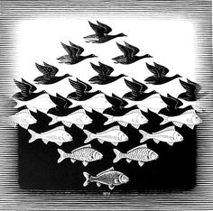
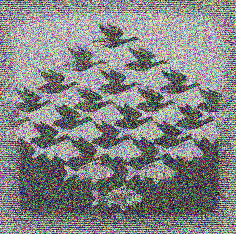

# genetic-image-recreation
---

This application was the final course project for my **SFWRENG 2S03** - Principles of Programming course. We were tasked to create a **genetic algorithm** for the recreation of a given image starting from a randomaly generated PPM image. To further improve the accuracy of the produced image, an exponentially decaying adaptive learning rate was applied to the algorithm.

### Sky and Water I
The Original image a long with the image recreated by the algorithm
### Original & Recreated Image

### Gif of Image Recreation
